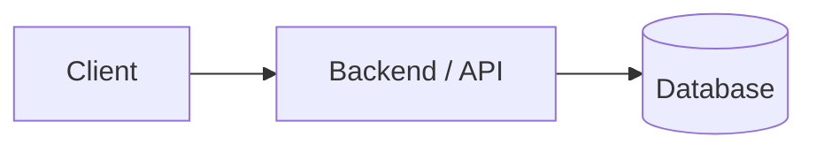

# Multi-tier architecture (1-, 2-, 3-, N-tier)
# N-tier = how you design layers


---

## Table of contents

1. [At a glance](#at-a-glance)
2. [1-tier](#1-tier-single-tier)
3. [2-tier](#2-tier-client--data)
4. [3-tier](#3-tier-presentation--application--data)
5. [N-tier](#n-tier-beyond-three-layers)
6. [Common confusion: “Frontend + MongoDB”](#common-confusion-frontend--mongodb)
7. [Interview-style answer](#interview-style-answer)
8. [Managed backends (e.g. Firebase / Supabase)](#managed-backends-eg-firebase--supabase)

---

## At a glance

| Architecture | Layers (idea) | Typical use | Complexity |
|--------------|----------------|-------------|------------|
| **1-tier** | UI + logic + data **together** | Desktop tools, local scripts, in-memory prototypes | Very low |
| **2-tier** | **Client ↔ database** (direct) | Legacy / internal tools; **avoid** exposing DB to browsers | Low |
| **3-tier** | **Client → API → database** | Standard web & mobile backends | Medium |
| **N-tier** | 3-tier **plus** gateways, services, cache, queues, CDN, LB | Large / microservice / event-driven systems | High |

**One-line map**

- **1-tier** — everything in one place (no separate server story).
- **2-tier** — client talks **straight to the DB** (theoretical pattern; databased exposed no security).
- **3-tier** — client → **backend** → DB (**what most production web apps use**).

---

## 1-tier (single-tier)

**What:** UI, business logic, and data live in **one process or environment** (e.g. one desktop app, or a page that only keeps state in memory).

**Why:** simplest to build; no network between layers; fine for small or local tools.

**Examples**

- Classic **MS Access**–style app: forms + logic + local DB file.
- **Script + SQLite** on one machine.
- **Browser-only demo:** `let users = [];` — UI + logic + “data” in memory (**no** backend, **no** real DB) → still **1-tier** from an architecture standpoint.

**Flow**

```text
User → Single app (UI + logic + data)
```

> No separate API tier; everything is **tightly coupled** in one deployment unit.

---

## 2-tier (client ↔ data)

**What:** **Two** layers: a **client** (UI, often some logic) and a **data store** (usually a database server).

**Why:** persistence and multi-user access vs a pure local app; still a small topology.

**Examples**

- Thick client (e.g. old **Java desktop ↔ MySQL**).
- A SPA that **directly** queries a database (anti-pattern for public internet — credentials and schema exposed).

**Flow**

```text
Client → Database
```

| Upside | Downside |
|--------|----------|
| Few moving parts | **DB exposed to clients** = security and ops nightmare on the web |
| | Hard to enforce business rules, rate limits, and auditing in one place |

---

## 3-tier (presentation → application → data)

**What:** Three classic layers:

| Layer | Role | Example in your stack |
|-------|------|------------------------|
| **Presentation** | UI | Next.js, mobile app |
| **Application** | API, rules, auth | NestJS, Express |
| **Data** | Persistence | MongoDB, PostgreSQL |

**Why:** **separation of concerns**, **security** (DB never trusts the browser directly), **scalability** (scale API and DB independently). This is the **default** mental model for production web systems.

**Flow**



```text
Client → Backend (API) → Database
```

---

## N-tier (beyond three layers)

**What:** **3-tier extended** with more **logical or physical** tiers: not necessarily “more code in one repo,” but **more hops or services** in the path.

**Common extra layers**

| Piece | Role |
|-------|------|
| **Load balancer** | Spreads traffic across app instances |
| **API gateway** | Routing, auth, throttling, composition |
| **Microservices** | User service, billing service, … |
| **Cache (e.g. Redis)** | Fast reads, session store |
| **Message queue (e.g. Kafka)** | Async work, decoupling |
| **CDN** | Static assets at the edge |

**Example stack sketch (Netflix / Uber–class)**

```text
Client
  → CDN / edge
  → API Gateway
  → Auth / User / … services
  → Cache / DB / Queue
```

**Why:** **scale** parts independently, **isolate** failures, improve **latency** and **throughput** — at the cost of **complexity**.

---

## Common confusion: “Frontend + MongoDB”

| Scenario | How people describe it | Notes |
|----------|-------------------------|--------|
| UI + data **only in memory** (e.g. array in browser) | **1-tier** | No persistent store, no API |
| UI **directly** connects to MongoDB | **2-tier** *in theory* | Almost **never** acceptable for a **public** web client (secrets, injection, no central policy) |
| UI → **your backend** → MongoDB | **3-tier** | **Standard** — backend owns validation, auth, queries |

**Important correction**

- **“Frontend + MongoDB”** sounds like two tiers, but **in real products** you put an **API in the middle** → that is **3-tier**, not “MongoDB counts as the only server.”

---

## Interview-style answer

**Q: “Is frontend + MongoDB two-tier?”**

**A:** *If the browser talked straight to the database, you could call that two-tier in textbook terms. In practice we don’t do that for web apps: we add an application layer that authenticates, validates, and queries the database. So production systems are **three-tier**: client, API, database — which gives security and scalability.*

---

## Managed backends (e.g. Firebase / Supabase) 
(Frontend → Managed Backend (Firebase/Supabase) → Database)

👉 The company (Firebase/Supabase) is running:
Hidden Middle Layer (IMPORTANT)
Authentication (JWT, sessions)
Authorization (rules / policies)
Business logic (cloud functions)
API layer (REST/GraphQL)
Rate limiting / security
Data validation
So actual architecture is:
Frontend → Managed Backend (Firebase/Supabase) → Database