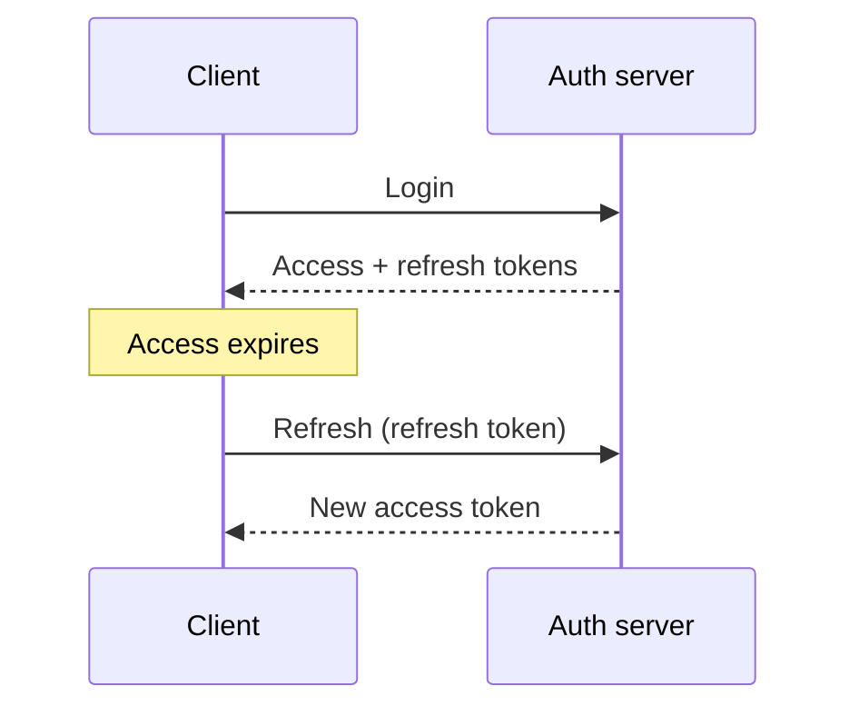

# Authentication
Identifying who the user is.

---

## Table of contents

1. [Authentication vs authorization](#1-authentication-vs-authorization)
2. [Authentication approaches](#2-authentication-approaches)
3. [How JWT verification works](#3-how-jwt-verification-works)
4. [User verification strategies](#4-user-verification-strategies)
5. [Access token + refresh token](#5-access-token--refresh-token)
6. [Token storage (security)](#6-token-storage-security)
7. [JWT in distributed systems](#7-jwt-in-distributed-systems)
8. [HS256 vs RS256](#8-hs256-vs-rs256)
9. [NestJS authentication flow](#9-nestjs-authentication-flow)
10. [Security best practices](#10-security-best-practices)

---

## 1. Authentication vs authorization

| | **Authentication** | **Authorization** |
| **Question** | *Who* is this user? | *What* may this user do? |
| **Examples** | Email + password login; verifying a JWT | Admin vs normal user; read / write / delete rules |

**Why both matter**
- **Authentication** binds the request to an identity.
- **Authorization** enforces what that identity is allowed to do.

**Typical request path**


---

## 2. Authentication approaches

### 2.1 Session-based authentication
**Idea:** The server stores session state; the client only holds a session identifier (usually in a cookie).

**Flow**

1. **Login** → server creates a session → response sets a `sessionId` cookie.
2. **Later requests** → browser sends the cookie → server loads the session from store.

| Pros | Cons |
|------|------|
| Straightforward logout (delete session) | Needs shared or sticky storage (Redis, DB, etc.) |
| Strong server-side control | Stateful; scaling needs care |

---

### 2.2 JWT (token-based authentication)

**Idea:** A **self-contained** token carries claims (e.g. user id, roles) and a signature so receivers can verify integrity without a session lookup.

**Structure**

```text
HEADER.PAYLOAD.SIGNATURE
```

**Flow**

1. **Login** → server issues a JWT → client stores it (see [token storage](#6-token-storage-security)).
2. **Requests** → client sends `Authorization: Bearer <token>`.
3. **Server** → verifies signature and claims (expiry, issuer, etc.).

| Pros | Cons |
|------|------|
| Stateless verification (no session row per request) | Revocation is harder than deleting a session |
| Scales across services if keys/secrets are aligned | Stolen token can be replayed until expiry |

---

## 3. How JWT verification works

**Steps**

1. **Extract** the token from `Authorization: Bearer <token>` (or another agreed transport).
2. **Verify signature** — e.g. `HMAC(header + payload, SECRET)` for symmetric schemes; compare to token signature.
3. **Compare** — match → integrity OK; mismatch → reject.
4. **Check `exp`** (and other time claims like `nbf` if you use them).
5. **Decode payload** — e.g. `{"userId": "123", ...}`.

> **What JWT proves**  
> JWT verification confirms **integrity** and **authenticity** of the token (it was signed by someone who holds the secret or private key).  
> It does **not** by itself prove the user still exists, is not banned, or still has the same roles — that requires extra checks.

---

## 4. User verification strategies

### Option 1 — Trust the JWT payload only

```javascript
validate(payload) {
  return payload;
}
```

| Pros | Cons |
|------|------|
| Fast, no extra I/O | Deleted or disabled users may still be “valid” until token expires |
| Scales easily | Role changes lag until new token |

---

### Option 2 — Hit the database (or cache) every time

```javascript
const user = await findUser(payload.userId);
```

| Pros | Cons |
|------|------|
| Accurate, reflects current state | Latency and load on every authenticated request |

---

### Recommended hybrid

- **Short-lived access tokens** (e.g. ~15 minutes).
- **Refresh tokens** for silent renewal.
- **Optional** DB or cache validation on sensitive routes or periodically.

---

## 5. Access token + refresh token

| Token | Role |
|--------|------|
| **Access** | Short-lived; sent with API calls |
| **Refresh** | Long-lived; used only to obtain new access tokens |

**Flow**



**Why it helps**

- Limits blast radius if an access token leaks (short window).
- Refresh can be rotated, bound to device, or stored more strictly than access.

---

## 6. Token storage (security)

| Approach | Guidance |
|----------|----------|
| **`localStorage` / `sessionStorage`** | Avoid for bearer tokens — high **XSS** risk if any script runs on your origin |
| **Access token** | Prefer **memory** (in-app variable) when possible |
| **Refresh token** | Prefer **HttpOnly**, **Secure**, **SameSite** cookie (with CSRF strategy if needed) |

---

## 7. JWT in distributed systems

**Shared verification material**

- **HS256:** same **secret** on every service that verifies (and signs).
- **RS256:** **private key** signs; **public key** verifies — safer for many verifiers.

**Flow**

```text
Service A (issuer)  --sign-->  JWT
Service B (API)     --verify with shared secret or public key-->  OK
```

**Outcome**

- No central session store required for verification.
- Horizontal scaling is straightforward if key distribution is solved.

---

## 8. HS256 vs RS256

| | **HS256** | **RS256** |
|---|-----------|-----------|
| **Keys** | Single shared secret | Key pair: private (sign), public (verify) |
| **Risk** | Secret leak compromises **signing and verifying** everywhere | Leaked **public** key cannot mint tokens |
| **Fit** | Simple monoliths, internal services | Microservices, many verifiers, public JWKS |

---

## 9. NestJS authentication flow

Typical pipeline with `@nestjs/passport` and JWT:

```text
HTTP request
    ↓
AuthGuard
    ↓
JWT Strategy (extract + verify)
    ↓
jwt.verify()
    ↓
validate(payload)  →  attach req.user
    ↓
Controller
```

---

## 10. Security best practices

**Do**

| Practice | Why |
|----------|-----|
| HTTPS everywhere | Protects tokens and credentials on the wire |
| Hash passwords (e.g. bcrypt, argon2) | Never store plaintext passwords |
| HttpOnly cookies for refresh (when using cookies) | Reduces token theft via XSS |
| Short-lived access tokens | Shrinks replay window |
| Enforce `exp` (and clock skew policy) | Reject stale tokens |
| Rate limit login and refresh endpoints | Slows credential stuffing and brute force |

**Don’t**

| Anti-pattern | Why |
|--------------|-----|
| Long-lived access tokens in the browser | Larger theft window |
| Tokens in `localStorage` for sensitive apps | XSS can exfiltrate |
| Verbose errors on auth failures | Helps attackers probe accounts and flows |
| Hardcoded secrets in repo | Use env / secret managers; rotate keys |

---

*Last aligned with your original outline; section 10 was formerly labeled “13.”*
