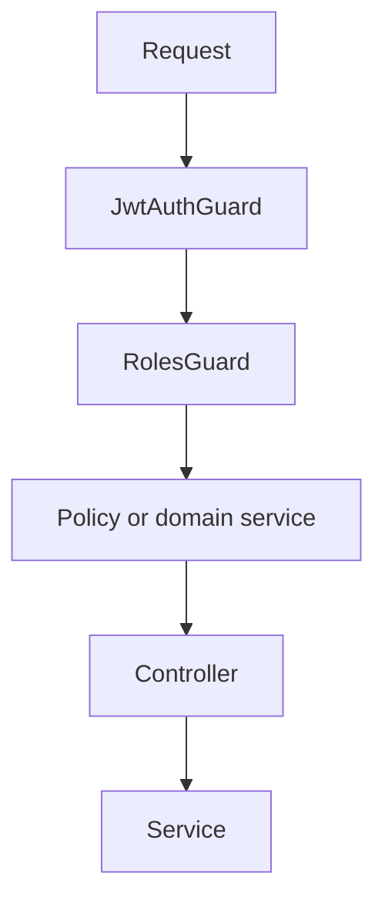

# Authorization

RBAC, ABAC, how they differ, and how they often show up together in APIs (including a NestJS-shaped example).

---

## Table of contents

1. [Overview](#1-overview)
2. [Role-Based Access Control (RBAC)](#2-role-based-access-control-rbac)
3. [Attribute-Based Access Control (ABAC)](#3-attribute-based-access-control-abac)
4. [RBAC vs ABAC](#4-rbac-vs-abac)
5. [Hybrid approach](#5-hybrid-approach)
6. [NestJS authorization architecture](#6-nestjs-authorization-architecture)
7. [Best practices](#7-best-practices)

---

## 1. Overview

**Authorization** decides *what* an **authenticated** principal may do on which **resources** — create a post, delete another user’s file, read billing for a tenant, etc.

**Typical request path**


**Authentication vs authorization**

| Concept | Question |
|---------|----------|
| **Authentication** | *Who* is this user? |
| **Authorization** | *What* may they do (and on what)? |

---

## 2. Role-Based Access Control (RBAC)

**Idea:** Users get **roles**; roles map to **permissions**. The system checks role → permission, not arbitrary per-user rules in every handler.

**Model**

```text
User → Role → Permissions
```

**Example claims / session shape**

```json
{
  "userId": "123",
  "role": "admin"
}
```

**Role → permission matrix (example)**

| Role | Permissions |
|------|----------------|
| **Admin** | create, read, update, delete |
| **Manager** | read, update |
| **User** | read |

| Advantages | Limitations |
|-------------|-------------|
| Simple to explain and implement | **Role explosion** when reality doesn’t fit a small role set |
| Fits many CRUD apps | Weak for **dynamic** or **resource-scoped** rules (“only if owner”) |
| Easy audits (“who is admin?”) | Fine-grained rules get awkward as role × permission grid grows |

---

### NestJS-style RBAC (sketch)

**Roles decorator**

```typescript
import { SetMetadata } from '@nestjs/common';

export const Roles = (...roles: string[]) =>
  SetMetadata('roles', roles);
```

**Roles guard (concept)**

```typescript
canActivate(context: ExecutionContext): boolean {
  const requiredRoles = this.reflector.get<string[]>(
    'roles',
    context.getHandler(),
  );

  if (!requiredRoles) return true;

  const request = context.switchToHttp().getRequest();
  const user = request.user;

  return requiredRoles.includes(user.role);
}
```

**Usage**

```typescript
@UseGuards(JwtAuthGuard, RolesGuard)
@Roles('admin')
@Get('/users')
```

---

## 3. Attribute-Based Access Control (ABAC)

**Idea:** Allow/deny from **attributes**: who the user is, what the resource is, and **context** (time, tenant, IP, etc.) — often expressed as policies or predicates.

**Model**

```text
User attributes + Resource attributes + Context → Allow / Deny
```

**Minimal example**

```javascript
if (user.id === post.ownerId) {
  allow();
}
```

**Attribute families**

| Kind | Examples |
|------|----------|
| **User** | `id`, `role`, `department`, `tenantId` |
| **Resource** | `ownerId`, `status`, `classification` |
| **Context** | time window, location, request route, environment |

**Example policy**

```javascript
function canEditPost(user, post) {
  return (
    user.role === 'admin' ||
    user.id === post.ownerId
  );
}
```

| Advantages | Limitations |
|-------------|-------------|
| Flexible, close to real rules | Harder to implement and test |
| Fine-grained, resource-aware | Policies can sprawl without discipline |
| Scales conceptually to complex orgs | Needs clear **policy** ownership and tooling at scale |

---

## 4. RBAC vs ABAC

| | **RBAC** | **ABAC** |
|---|----------|----------|
| **Based on** | Roles (and fixed permission sets) | Attributes + policies |
| **Flexibility** | Lower | Higher |
| **Complexity** | Lower | Higher |
| **Scalability** | Medium (until role matrix explodes) | High *if* policies are managed well |
| **Typical fit** | Straightforward apps, admin panels | Multi-tenant, ownership, compliance-heavy flows |

---

## 5. Hybrid approach

> **Practical default:** Use **RBAC** for coarse gates (“only `admin` hits `/admin`”) and **ABAC** (or ownership checks) for **resource-level** rules (“only owner or moderator can edit this post”).

**Example:** coarse role + ownership / safety edge cases

```javascript
function canDeleteUser(actor, targetUser) {
  if (actor.role === 'admin') return true;

  if (actor.id === targetUser.id) return false; // e.g. block self-delete via this path

  return false;
}
```

**Why combine**

- **RBAC** — fast, readable **route- or feature-level** rules.
- **ABAC / predicates** — **object-level** rules (owner, state, tenant).

---

## 6. NestJS authorization architecture

**Layered mental model**

```text
Request
  ↓
JwtAuthGuard        ← authentication (who)
  ↓
RolesGuard          ← RBAC (role × route)
  ↓
Policy / service    ← ABAC or ownership (resource + context)
  ↓
Controller
  ↓
Service
```



---

## 7. Best practices

**Do**

| Practice | Note |
|----------|------|
| Use **guards** (or middleware) for authz at the boundary | Keeps handlers thin |
| **Separate** RBAC (roles) from resource rules (ownership, state) | Easier to test and evolve |
| **Centralize** permission logic | One place to audit and change rules |
| **Validate resource ownership** where it matters | Don’t trust IDs from the client alone |
| **Constants / enums** for roles and permission names | Avoid string typos across the codebase |

**Avoid**

| Anti-pattern | Why |
|--------------|-----|
| Hardcoding role strings in many controllers | Drift and inconsistency |
| Mixing **business rules** and **authorization** with no structure | Hard to reason about security |
| Ignoring **edge cases** (self-delete, cross-tenant access, archived resources) | Common source of bugs and leaks |
| ABAC everywhere for a **simple** app | Unnecessary complexity |

---

*Pairs with [Authentication](./Authentication.md) — authenticate first, then authorize.*
